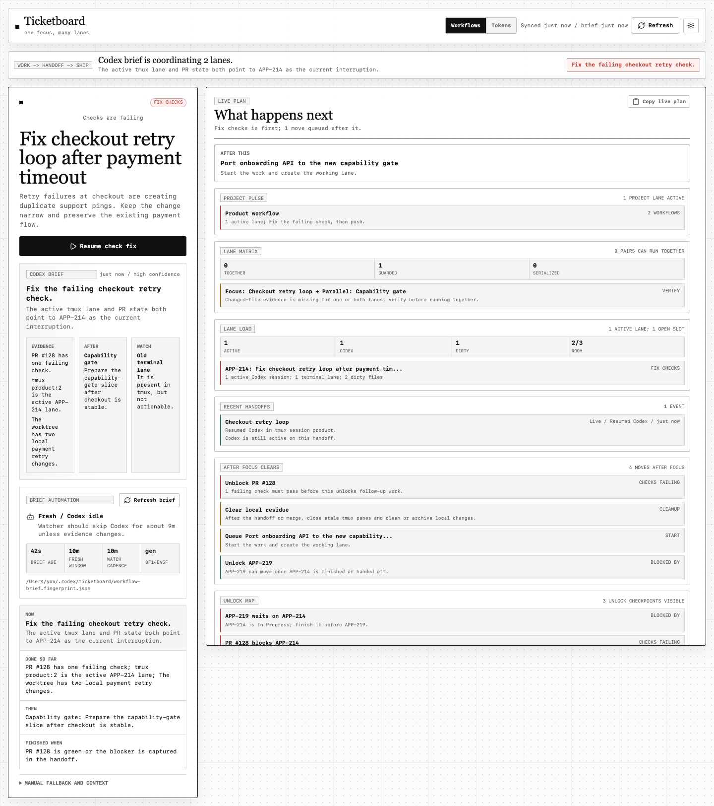
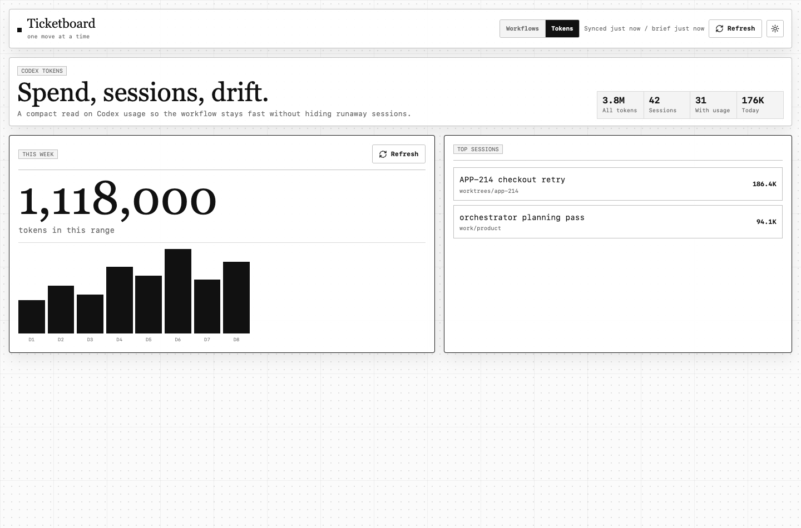

# Ticketboard

Ticketboard is a local dashboard for the daily software engineering loop: active tickets, pull requests, Codex sessions, tmux lanes, worktrees, and token usage in one place.

It is designed to answer one question quickly: **what should own focus, what can run in parallel, and why?**





## What It Does

- Picks one current workflow from live local and remote signals.
- Maps Linear blockers and PR gates into an unlock order.
- Forecasts what finishing the focused lane should unlock or queue next.
- Groups active work by Linear project so project pressure is visible before lane detail.
- Builds a project runway from Linear project work: current, next, blocked, and recently done.
- Shows current Codex, terminal, and dirty worktree lane load against the planned capacity.
- Builds a lane plan for focus work, parallel Codex candidates, waiting checkpoints, and cleanup.
- Shows a lane matrix for which ticket pairs can run together, need guards, or must serialize.
- Turns the safe-batch decision trail into ordered parallel waves: run together now, on deck, checkpoints, and guarded work.
- Names the current safe batch of lanes that can run together without changed-file conflicts.
- Serializes safe batches when Linear relations show one ticket blocks another.
- Explains why each parallel lane is ready, guarded, or waiting in the batch decision trail.
- Copies a safe-batch packet with run-now lanes, decision trail, and guardrails.
- Revalidates live dashboard and brief state before running every currently safe automated lane in the batch.
- Records safe-batch launches as grouped parallel-run receipts, so later plans remember which lanes started together.
- Guards Codex lane actions when focus safety is unknown, files overlap, or lane capacity is full.
- Refuses duplicate backend Codex starts when a live session, terminal lane, or worktree already owns the same workflow.
- Opens existing cleanup worktrees instead of spawning fresh Codex lanes for leftover local residue.
- Uses PR files and worktree status to flag shared code areas before running parallel lanes.
- Offers a next-safe-lane action when one parallel Codex handoff is ready.
- Tracks recent handoff outcomes so launched or resumed lanes show live, quiet, or cleared state in both the UI and Codex evidence.
- Builds a source dossier for each workflow from Linear project/cycle/labels, attachments, recent comments, related blockers, PR files, Codex sessions, tmux windows, and worktrees.
- Includes that source dossier in copied work packets, Codex lane prompts, and the Codex evidence snapshot.
- Writes deterministic parallel-readiness evidence for Codex: lane load, candidates, blocker edges, file conflicts, pairwise safety, and suggested waves.
- Marks generated briefs stale when their parallel-readiness fingerprint no longer matches current lane evidence.
- Defines a lane contract for every workflow: preflight checks, finish proof, and after-handoff refresh steps.
- Queues and flags a refreshed Codex plan whenever a workflow handoff is newer than the current brief.
- Lets you manually queue a fresh Codex plan from the dashboard without running a terminal command.
- Checks for evidence drift while a brief is still fresh, so PR merges, check changes, handoffs, or planning-doc edits can trigger a new Codex plan before the 10-minute cadence expires.
- Gives Codex read-only GitHub, Linear, git, and tmux verification hints so missing API keys do not block source-of-truth checks.
- Shows brief freshness, watcher cadence, lock state, and last evidence fingerprint.
- Explains the selected move with evidence, latest signal, terminal context, and finish criteria.
- Can focus an existing tmux lane, create a worktree, resume Codex, open a PR, or launch a new Codex lane.
- Shows a generated project plan: done, current, next, cleanup, and stale signals.
- Copies a live-plan packet that mirrors the planning-doc workflow across projects, lanes, unlocks, and handoffs.
- Keeps `/tokens` as a separate Codex usage page for spend, trends, and heavy sessions.

## How It Works

Ticketboard keeps the browser thin. The backend gathers state, validates actions, and only exposes structured commands.

1. Local collectors read tmux windows, Codex sessions, git worktrees, GitHub PRs, Linear tickets, and cached state.
2. A deterministic scorer builds a fallback workflow queue, so the app still works without any generated brief.
3. The optional Codex automation exports an evidence snapshot from `/api/workflow-brief/evidence-snapshot`, including recent handoffs, queued refresh reasons, and read-only source verification hints.
4. Local Codex runs in permission-bypass mode, reads that snapshot, verifies stale or missing source data through available MCP/CLI access, reasons over focus plus safe parallel lanes, and writes a structured JSON brief.
5. The UI renders the Codex brief when it is fresh; otherwise it falls back to deterministic focus/parallel/cleanup lanes.

The app does not call LLM APIs or store model keys. GitHub and Linear enrichment can come from your local CLI/MCP setup; API keys are only needed if you want the backend collectors to call those services directly.

## Quick Start

```bash
pnpm install
make
```

Open `http://localhost:4317`.

## Local Codex Brief

With the dev server running, inspect the evidence snapshot and generated prompt paths:

```bash
pnpm brief:snapshot
```

Generate a fresh workflow brief with the authenticated local `codex` CLI:

```bash
pnpm brief:codex
```

Run the guarded automation loop in a separate terminal or tmux lane:

```bash
pnpm brief:watch
```

`brief:watch` checks the current brief status, skips work while the brief is fresh, and runs one generator at a time using a local lock file. While a brief is fresh, it compares the current evidence fingerprint about once per minute; if PRs, checks, handoffs, local lanes, or planning docs changed, it regenerates immediately instead of waiting for the 10-minute cadence. Handoff-triggered refresh requests are polled with a cheap marker-only check every few seconds, so the watcher can wake before the next drift check without refreshing every data source. When a brief is stale only because of age, the watcher compares a stable evidence fingerprint first; if nothing meaningful changed, it refreshes the existing brief without starting another Codex process. The generator uses non-interactive `codex exec` with JSON output and terminal color disabled; if a Codex version rejects non-terminal stdin, the generator retries once through a local `script(1)` pseudo-terminal. The default Codex cadence is roughly 10 minutes, with drift checks every minute. Use `--once` for a single check, `--force` to ignore freshness/fingerprints, `--no-drift-check` to disable fresh-brief fingerprint checks, `--rerun-on-preview-change` to include tmux pane previews in the fingerprint, or `--no-yolo` if you need Codex to ask for approvals.

The generated brief is written to `TICKETBOARD_WORKFLOW_BRIEF_PATH`, then read by the dashboard on refresh. `TICKETBOARD_PLAN_DOC_PATH`, `TICKETBOARD_PLAN_DOC_PATHS`, and `TICKETBOARD_PLAN_DOC_GLOBS` are optional; when set, Ticketboard adds those local planning documents plus extracted done/current/next/blocked signals to the Codex evidence snapshot, but the app does not hardcode any specific plan file.

Codex runs with the `--yolo`-equivalent `codex exec` permission bypass flags by default for this workflow, so only run the watcher in repositories and environments where that level of local permission is acceptable. `make dev` keeps the dashboard server running if the optional brief watcher exits.

## Configuration

Create `.env` from `.env.example` when you want local overrides. The defaults are intentionally local-first.

| Variable | Purpose |
| --- | --- |
| `PHOEBE_REPO_PATH` | Path to the main repository that Ticketboard should inspect. |
| `TICKETBOARD_REPO` | GitHub repository name in `owner/name` form. |
| `PORT` | Web server port. Defaults to `4317`. |
| `TICKETBOARD_ACTION_SESSION` | tmux session used for new workflow lanes. |
| `TICKETBOARD_WORKTREE_ROOT` | Directory where new ticket worktrees are created. |
| `TICKETBOARD_PLAN_DOC_PATH` | Optional planning document included in Codex evidence snapshots. |
| `TICKETBOARD_PLAN_DOC_PATHS` | Optional comma- or path-list of additional planning documents for Codex evidence. |
| `TICKETBOARD_PLAN_DOC_GLOBS` | Optional comma-separated glob patterns for planning documents. |
| `TICKETBOARD_WORKFLOW_BRIEF_PATH` | JSON file written by local Codex and read by the app. |
| `TICKETBOARD_WORKFLOW_SNAPSHOT_PATH` | Evidence snapshot written by Ticketboard for Codex. |
| `TICKETBOARD_WORKFLOW_FINGERPRINT_PATH` | Optional sidecar path for the last evidence fingerprint used by Codex automation. |
| `TICKETBOARD_WORKFLOW_REFRESH_REQUEST_PATH` | Optional marker path for handoff-triggered brief refresh requests. |
| `TICKETBOARD_WORKFLOW_BRIEF_TTL` | How long a generated brief is treated as fresh, in seconds. |
| `TICKETBOARD_WORKFLOW_AUTOMATION_INTERVAL_MS` | Brief watcher cadence. Defaults to 10 minutes. |
| `TICKETBOARD_WORKFLOW_DRIFT_CHECK_MS` | Fresh-brief evidence drift check cadence. Defaults to 1 minute. |
| `TICKETBOARD_WORKFLOW_AUTOMATION_RETRY_MS` | Retry delay after status/generation failures. |
| `TICKETBOARD_WORKFLOW_REFRESH_REQUEST_CHECK_MS` | Cheap marker-only poll cadence for handoff-triggered brief refresh requests. |
| `TICKETBOARD_WORKFLOW_LOCK_TTL_MS` | When an abandoned watcher lock can be replaced. |
| `TICKETBOARD_CODEX_BIN` | Codex executable used by brief generation. Defaults to `codex`. |
| `TICKETBOARD_CODEX_ARGS` | Additional Codex CLI args. Permission-bypass flags are added unless `--no-yolo` is passed. |
| `TICKETBOARD_GITHUB_LOGIN` | Optional GitHub login override; otherwise `gh` auth is used. |
| `LINEAR_API_KEY` | Optional Linear collector token. Cached data and Codex/MCP flows can work without it. |
| `TICKETBOARD_LINEAR_ASSIGNEE` | Optional Linear owner filter. |
| `TICKETBOARD_TICKET_PREFIXES` | Ticket prefixes parsed from branches, PRs, sessions, and text. |

Most cache TTLs are also configurable in `.env.example`, but they are not required for normal use.

## Useful Commands

| Command | Description |
| --- | --- |
| `make` | Start the dev server and guarded Codex brief watcher together. |
| `make dev` | Same as `make`; accepts `PORT`, `TICKETBOARD_URL`, and `BRIEF_WATCH_ARGS`. |
| `pnpm dev` | Start the local Express/Vite server. |
| `pnpm brief:snapshot` | Write and print the Codex evidence snapshot/prompt paths. |
| `pnpm brief:codex` | Ask local Codex to generate the workflow brief JSON once. |
| `pnpm brief:watch` | Run the guarded 10-minute local Codex automation loop. |
| `pnpm typecheck` | Run strict TypeScript checks. |
| `pnpm lint` | Run ESLint and Ruff. |
| `pnpm build` | Build the production Vite bundle. |
| `pnpm verify:brief` | Verify deterministic workflow-brief safety guards. |
| `pnpm verify:ui` | Run the Playwright smoke checks against a running server. |
| `pnpm screenshots:readme` | Regenerate sanitized README screenshots from mocked demo data. |

## Workflow Actions

The primary action on the selected workflow is validated against the current dashboard snapshot before anything runs. Supported actions include focusing tmux, creating a ticket worktree, launching Codex with a generated prompt, resuming a known Codex session, opening a PR, or opening a worktree/source link.

Codex-starting actions move the workflow out of the way after a successful handoff, so the board advances to the next move. Skipped and handed-off moves are persisted by the backend for the day, with browser storage only used as a fallback.

## Screenshots

The README screenshots are generated from mocked demo data so private tickets, paths, repositories, and token details are not exposed.

```bash
pnpm dev
pnpm screenshots:readme
```
